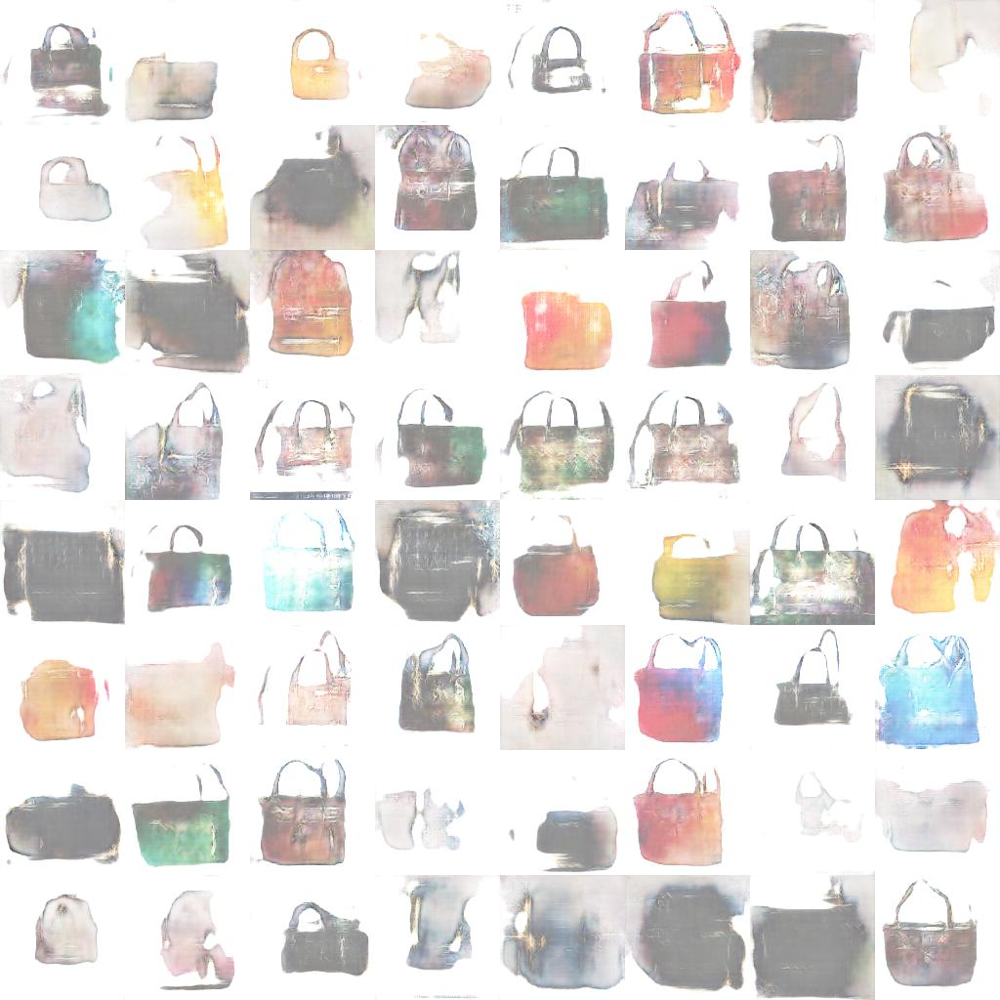

# w-GAN

## Overview
I will use a WGAN to create new kinds of bag image. 

## Dependencies (pip install) 
```
cv2
tensorflow
scipy
numpy
```
## Usage
```
cd WGAN
python resize.py
python RGBA2RGB.py
python WGAN.py
``` 

## example bag after 50 epochs


## example bag after 1000 epochs




## Credits

The credits for this code goes to [moxiegushi](https://github.com/moxiegushi/pokeGAN). I made slight adaptation on data preprocessing for web scrapped bag image.
